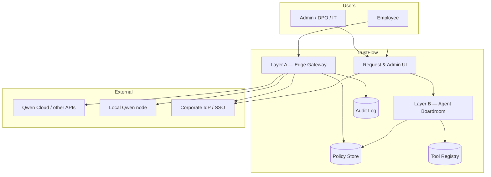
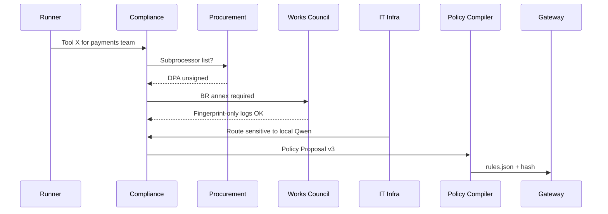

# TrustFlow — product architecture

**Status:** Implemented (hackathon MVP, 2026-07-06).  
**Audience:** Shirley, teammate, implementers.  
**Principle:** Deterministic enforcement at the edge; generative negotiation only for policy *authoring*.

---

## 1. Problem statement (validated)

Enterprises want employees on AI tools; IT/Legal/DPO/Betriebsrat block or slow rollouts because:

1. **Approval friction** dominates public discourse (R3: 21/55 `approval_process` tags).
2. **Shadow AI** fills the gap when official channels fail (R0006, R0014).
3. **DE-specific gates** (Betriebsvereinbarung, §87 BetrVG) are invisible in English forums but decisive in target market (R2, practitioner batch).
4. **Enforcement gap:** policies exist without DLP/gateway monitoring (R0008).

TrustFlow compresses weeks of stakeholder negotiation into a **parameterized policy** compiled to deterministic gateway rules — with an audit trail that satisfies limited-risk deployer duties today and scales to high-risk fields when needed (R1).

---

## 2. System context



**Hackathon MVP** can demo Boardroom + mock Gateway (policy compile + sample deny/allow) without production-grade proxy throughput.

---

## 3. Layer A — Edge Gateway (deterministic)

### 3.1 Responsibilities

| Function | Mechanism | Must not |
|----------|-----------|----------|
| Authenticate caller | SSO/JWT from IdP | Guess identity via LLM |
| Load active policy | `policy_id` + version hash | Re-interpret legal text at runtime |
| Classify request risk tier | Rule table from policy | LLM-only classification |
| PII detect + mask/block | Regex + NER library (configurable) | Send raw IBAN/names to cloud |
| Route model | Policy `routing` rules | Hallucinate routing |
| Enforce budget | Token counter per dept pool | Soft limits only |
| Emit audit events | Schema in `gateway-audit-event.schema.json` | Manual logging |
| Deny with reason code | Enum (see DEFINITIONS) | Opaque 403 |

### 3.2 Request lifecycle

```
1. Employee → POST /v1/inference { tool_id, messages, context }
2. Gateway resolves: user, dept, tool registration status
3. Gateway loads policy_version_hash (cache)
4. Pre-flight checks (ordered):
   a. tool approved?
   b. betriebsvereinbarung_status == signed (if DE entity)?
   c. budget remaining?
   d. risk tier permits use case?
   e. PII scan → mask | block
5. Route to model per policy.routing
6. Post-flight: fingerprint output, emit audit event
7. Return response + disclosure flag if Art. 50
```

### 3.3 Deny reason codes (canonical)

| Code | Layer | Typical resolver |
|------|-------|------------------|
| `TOOL_NOT_APPROVED` | Registry | Boardroom + procurement |
| `BETRIEBSVEREINBARUNG_PENDING` | Governance | Works council process |
| `VENDOR_DPA_PENDING` | Procurement | Legal |
| `PII_BLOCK` | Gateway | Runner changes use case or local route |
| `BUDGET_EXCEEDED` | Finance | Manager + IT |
| `HIGH_RISK_USE_DENIED` | Compliance | Human oversight workflow |
| `PROHIBITED_PRACTICE` | Compliance | Hard stop |

### 3.4 Deployment

**As built:** Hybrid — gateway + boardroom + UI in Docker Compose on Alibaba Cloud ECS. Local replay mode for judges (`npm run dev`, no API key).

| Model | Hackathon choice |
|-------|------------------|
| **Customer-hosted gateway** | Demo narrative — data stays in customer VPC |
| **Boardroom on Qwen Cloud** | Live `qwen-max` or golden replay |

---

## 4. Layer B — Agent Boardroom (generative)

### 4.1 Agent roster (expanded from hackathon sketch)

| Agent | Persistence | Model role | Owns |
|-------|-------------|------------|------|
| **Workflow Runner** | Per request | Advocate | Use case, urgency, productivity gain |
| **Corporate Compliance** | Permanent | Guardian | GDPR, EU AI Act, logging scope, DPIA triggers |
| **IT & Infra** | Permanent | Optimizer | Routing, cost, sovereignty, SSO |
| **Procurement & Vendor Risk** | Permanent | Gatekeeper | DPA, subprocessor list, VRM checklist |
| **Works Council Liaison** | Permanent (DE) | Co-design | Betriebsvereinbarung status, logging visibility to mgmt |

Compliance and Procurement can be **one LLM with two system prompt facets** in MVP to limit API calls; separate agents for demo clarity.

### 4.2 Negotiation input packet

```json
{
  "request_id": "uuid",
  "requester": { "user_id", "department", "role" },
  "tool": { "tool_id", "vendor", "data_residency", "audit_log_capability" },
  "use_case": { "category", "data_classes", "annex_iii_risk" },
  "org_context": {
    "entity_country": "DE",
    "betriebsvereinbarung_status": "pending|signed|n/a",
    "existing_policies": ["policy_id"]
  }
}
```

### 4.3 Negotiation output → policy compiler

Boardroom does **not** push rules directly. It emits a **Policy Proposal** (see `schemas/policy-artifact.schema.json`). A **deterministic compiler** validates and materializes `rules.json`:

- Reject proposal if schema invalid
- Reject if weaker than org `policy_floor` (non-negotiable red lines)
- Hash canonical JSON → `policy_version_hash`
- Write to Policy Store; gateway hot-reloads



### 4.4 Boardroom termination conditions

| Outcome | Condition |
|---------|-----------|
| **APPROVED** | All agents sign-off OR Compliance overrides with documented exception |
| **DENIED** | Hard red line (prohibited practice, no DPA path) |
| **PENDING_HUMAN** | Turn budget exhausted before all agents give final positions |
| **PENDING_EXTERNAL** | `BETRIEBSVEREINBARUNG_PENDING` — workflow outside product |

Debate flow (v2): opening → lane specialists → optional rebuttal beats → all-agent finals. Max **15** turns per session; see `docs/boardroom_protocol.md`.

### 4.5 LLM stack (hackathon)

| Component | Proposed | Rationale |
|-----------|----------|-----------|
| Boardroom agents | **Qwen-Max** (cloud) | Hackathon sponsor alignment |
| Policy compiler | **Code** (no LLM) | Safety |
| Gateway PII | **Library** (presidio / regex) | Deterministic |
| Embeddings for tool registry | Optional later | Not MVP |

---

## 5. Data stores

| Store | Contents | Retention |
|-------|----------|-----------|
| **Tool Registry** | Vendor metadata, DPA status, endpoints | Until decommission |
| **Policy Store** | Versioned `rules.json` + proposal history | Indefinite (audit) |
| **Audit Log** | `gateway-audit-event` records | ≥6 months (configurable class) |
| **Request Queue** | In-flight boardroom negotiations | 90 days |
| **Org Config** | Red lines, entity country, BR status | Admin-managed |

MVP: SQLite or JSON files. Production path: Postgres + immutable log object store.

---

## 6. UI surfaces (as implemented, 2026-07-05)

| Surface | Route | User | What it shows |
|---------|-------|------|----------------|
| **Employee portal** | `/employee` | Employee | Dashboard, new request, request detail (Agent negotiation, Gateway activity) |
| **Governance console** | `/governance` | DPO / IT / Procurement | Queues, human sign-off, appeals, org-wide audit |
| **Glassbox** | `/glassbox` | Judge / engineer | Boardroom-first theater — pipeline strip, live transcript, enforcement bar, click-to-inspect detail panel |
| **Strategy explorer** | `/strategy_explorer.html` (pitch link from glassbox legend) | Pitch | `prototypes/trustflow_strategy_explorer.html` |

**Product vs glassbox:** Employees see stakeholder review and gateway audit on their request;
they do **not** chat with tools inside TrustFlow (use IDE + governed gateway). Glassbox is
the deep technical view — pipeline stages with live summaries, boardroom transcript on stage,
click any stage chip for the full inspector (compiler, policy, gateway playground, audit).

**Architecture strip** (employee + governance): `Agents propose → Compiler signs → Humans approve → Gateway enforces`

---

## 7. Security & compliance architecture

| Concern | Approach |
|---------|----------|
| Secrets | API keys in vault; never in policy JSON |
| Prompt content | Fingerprints in audit log by default; raw opt-in with BR approval |
| Tenant isolation | `system_id` per deployment |
| EU AI Act Art. 50 | Gateway injects disclosure header when `disclosure_shown` |
| BetrVG | Product tracks status; legal process stays outside software |
| Eval safety | Boardroom outputs schema-validated; compiler is gate |

---

## 8. Non-goals (hackathon MVP)

- Full SSO integration (mock user/dept)
- Production Fortinet/Umbrella integration (reference in narrative only)
- Real Betriebsrat e-signature
- Multi-tenant SaaS billing
- Automated DPIA document generation
- G2/review ingestion pipeline

---

## 9. Extension points (post-hackathon)

1. **HRIS connector** — auto-detect high-risk use cases  
2. **SIEM export** — audit log streaming  
3. **Microsoft Graph** — Copilot license + usage sync  
4. **Langfuse eval harness** — boardroom regression tests on persona scenarios  

---

## 10. Related documents

| Doc | Purpose |
|-----|---------|
| [`schemas/policy-artifact.schema.json`](schemas/policy-artifact.schema.json) | Compiled policy shape |
| [`schemas/gateway-audit-event.schema.json`](schemas/gateway-audit-event.schema.json) | Audit event shape |
| [`boardroom_protocol.md`](boardroom_protocol.md) | Agent message protocol |
| [`hackathon/EVIDENCE_CHAIN.md`](hackathon/EVIDENCE_CHAIN.md) | Grounded claims for pitch |
