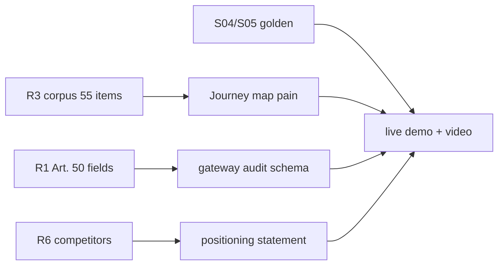

# Evidence chain — one pager

**Purpose:** Judge-ready proof that TrustFlow claims are grounded — not invented metrics.

---

## R3 market corpus (`corpus.jsonl`)

| Stat | Value | Source |
|------|-------|--------|
| Total items | **55** (29 posts/threads, 26 comments) | [`docs/research/evidence/corpus.jsonl`](../research/evidence/corpus.jsonl) |
| `approval_process` tag | **21** items | [`docs/research/evidence/synthesis.md`](../research/evidence/synthesis.md) |
| `shadow_ai` tag | 8 | same |
| `technical` tag | 12 | same |
| Primary source | Reddit r/sysadmin (51) + HN (4) | synthesis |

**Pitch line:** Approval friction dominates public discourse more than raw GDPR citations — lead demo with `approval_process` pain.

**Caveat:** English forums under-represent Betriebsrat — mitigated by R2 practitioner batch + DE persona (E001–E004).

---

## R1 → product: `disclosure_shown`

| Field | Meaning | Hackathon demo |
|-------|---------|----------------|
| `disclosure_shown` | EU AI Act **Art. 50** transparency — user informed they interact with AI | Present on allowed gateway audit events |
| `retention_class` | Deployer log retention (Art. 26(6) baseline) | `financial_sector` in S04 policy |
| `policy_version_hash` | Which compiled rules were enforced | Ties boardroom → compiler → gateway |

**Schema:** [`docs/schemas/gateway-audit-event.schema.json`](../schemas/gateway-audit-event.schema.json)  
**Research:** [`docs/research/01_eu_ai_act_audit_trail.md`](../research/01_eu_ai_act_audit_trail.md)

**Demo moment:** Governance → **Audit log** → expand event → point at `disclosure_shown: true`.

---

## Eval fixtures → negotiation evidence

| Scenario | Golden file | Proves |
|----------|-------------|--------|
| S04 | `app/backend/test/golden/S04.json` | Multi-lane compromise → sovereign route |
| S05 | `app/backend/test/golden/S05.json` | Procurement veto — unsigned DPA |
| S02 | roleplay + compiler | `BETRIEBSVEREINBARUNG_PENDING` external gate |

**Journey map:** [`docs/research/stakeholders/journey_map.md`](../research/stakeholders/journey_map.md) — actors × corpus IDs (R0008 enforcement gap, R0011 VRM).

---

## Competitor positioning (R6)

**Statement (use verbatim on slide 8):**

> **TrendAI** secures AI like a firewall. **Naaia** documents AI like a GRC system. **TrustFlow** negotiates AI like a boardroom and enforces AI like a gateway — so Legal, IT, Procurement, and Betriebsrat can say yes in hours, not months.

**Source:** [`docs/research/06_competitor_inspiration_for_trustflow.md`](../research/06_competitor_inspiration_for_trustflow.md) §6

**Quadrant:** High enforcement + high regulatory workflow = TrustFlow wedge (qualitative desk research).

---

## What we label honestly

| Claim | Label |
|-------|-------|
| 98% speedup (strategy explorer) | **Illustrative projection** |
| Weeks → seconds | Narrative from journey map, not A/B study |
| PII detection | Regex demo — IBAN BLOCK, email MASK |
| Single-agent baseline | Eval comparison S04/S05 — not published benchmark |

---

## Chain diagram

---

**Related:** [`EVIDENCE_CHAIN` parent folder](./) · [`../DEMO_SCRIPT.md`](../DEMO_SCRIPT.md) · [`PITCH_DECK_OUTLINE.md`](PITCH_DECK_OUTLINE.md)
