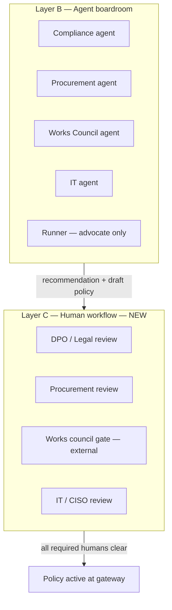

# PRD — Negotiation transparency + human-in-the-loop governance

**Status:** Draft v0.2 — decisions locked (2026-07-04)  
**Author:** Product session (Shirley + agent)  
**Next step:** Technical spec + build (separate session)  
**Related:** `boardroom_protocol.md`, `DEFINITIONS.md`, `ARCHITECTURE.md`, competitor synthesis R6 (HITL)

---

## 1. Executive summary

TrustFlow today compresses multi-stakeholder AI approval into an **agent boardroom**, but the product surfaces hide that story and **auto-finalize** outcomes as if humans were unnecessary. For a sensitive domain (GDPR, EU AI Act, Betriebsrat), that is the wrong mental model.

This PRD defines two connected capabilities:

1. **Negotiation transparency (product-complete)** — Every role sees *why* a decision is forming, with demo-ready seeded transcripts and promoted UI. Framed as **stakeholder review**, not “Agent Society” hackathon jargon.

2. **Human-in-the-loop (HITL) as a design principle** — Agents **accelerate** analysis and policy drafting; **humans retain authority** on outcomes that affect employees. Specifically:
   - **Agent recommends approve** → compiled policy exists, but **gateway access requires human sign-off**.
   - **Agent recommends deny** → employee gets an **Advocate Agent** to understand reasons and choose: **appeal** (human review), **propose alternative** (linked new request), or **accept** (case closed).

**Glassbox** remains the place for full technical depth (live SSE, compiler diff, scenario replay). **Employee + Governance portals** become the trust product.

---

## 2. Problem statement

### 2.1 What users experience today

| Pain | Evidence |
|------|----------|
| Negotiation is buried in a secondary tab and often **empty** (no `session_id` on demo requests) | Product QA, design review 2026-07-04 |
| Approved requests grant gateway access **without a human approval step** | `status: approved` set directly from boardroom `APPROVED` |
| Denied requests show codes/transcript but **no guided path** for the employee | `RequestDetail` ends at transcript |
| Governance console can **observe** but not **act** on recommendations | No sign-off / appeal queue |
| Positioning risk: looks like “AI replaced Legal/DPO” | Sensitive-topic feedback (this session) |

### 2.2 What we must communicate

> **AI agents prepare the decision. Humans own the decision.**

This aligns with EU AI Act deployer duties (Art. 26), DPO practice (provable control), and DE co-determination (Betriebsrat stays in the loop for monitoring-capable systems).

---

## 3. Product principles

| # | Principle | Implication |
|---|-----------|-------------|
| P1 | **Accelerate, never replace** | Agents draft policy, surface conflicts, cite evidence — humans sign off or override |
| P2 | **Transparency by default** | Employee sees stakeholder positions; governance sees full transcript + compiler lineage |
| P3 | **Deterministic enforcement** | Gateway still has no LLM; only **activated** policies after human sign-off are enforceable |
| P4 | **Right to understand + respond** | On deny, employee is not abandoned — Advocate Agent explains and offers structured next steps |
| P5 | **Audit everything** | Every human action (`sign_off`, `override`, `appeal_decision`) emits an auditable event with reviewer id |
| P6 | **Separate judge demo from product** | “Agent Society” branding stays in glassbox; product says “stakeholder review” / “policy negotiation” |

---

## 4. Personas & jobs-to-be-done

| Persona | Job | Success |
|---------|-----|---------|
| **Employee (Alex)** | Get a tool fast, understand blockers, know what to do next | Clear status, plain-language reasons, actionable paths on deny |
| **DPO / Governance (Katrin)** | Oversight without reading 40 emails | Queue of items needing sign-off; one-click approve/reject with rationale |
| **IT / CISO** | Enforce policy at edge | Policy hash only **active** after human sign-off |
| **Works council / Procurement** | External gates | `PENDING_EXTERNAL` unchanged — human process outside product, status tracked |
| **Judge / engineer** | See how sausage is made | Glassbox unchanged |

---

## 5. Target experience (narrative)

### 5.1 Happy path — approve with human sign-off

1. Alex submits **Claude Code** for code completion (payments team).
2. Dashboard shows **“Stakeholder review in progress”** with live turn count; Negotiation is the **default tab**.
3. Boardroom completes → outcome **Agent recommends approve**. Policy is **compiled but inactive** (`policy_status: draft`).
4. Alex sees: *“Stakeholders reached a recommendation. Waiting for DPO sign-off before you can use this tool.”*
5. Katrin sees request in **Sign-off queue** with compliance score, transcript summary, policy diff.
6. Katrin **signs off** → status `approved`, policy **activated** at gateway, audit event with `human_reviewer_id`.
7. Alex gets notification → **Use tool** CTA enabled.

### 5.2 Deny path — understand, then choose

1. Alex submits **ChatGPT Enterprise** for summarization; boardroom **recommends deny** (e.g. no DPA, high-risk pattern).
2. Status → **`denied_pending_employee`** (agent recommendation, employee has not accepted).
3. **Advocate Agent** (employee-facing Runner) opens automatically:
   - Explains *why* in plain language (maps `deny_code` + transcript to user copy).
   - Answers follow-up questions in chat (bounded to this request’s evidence).
4. Alex chooses one of three **structured actions**:

| Action | What happens | Human involved? |
|--------|--------------|-----------------|
| **Accept decision** | Status → `denied_closed`. Case closed. | No |
| **Appeal** | Status → `appeal_pending`. Enters governance **Appeal queue** with Alex’s statement. | **Yes** — DPO (or delegate) reviews |
| **Propose alternative** | Creates **linked child request** (`parent_request_id`), pre-filled with safer tool/use-case suggestions from Advocate + registry. New boardroom session. | Only if child reaches sign-off |

5. If appeal approved → human can override to sign-off path; if appeal denied → `denied_closed` with human rationale.

---

## 6. Request lifecycle (proposed state machine)

### 6.1 Status enum (employee request)

**Replace** the current flat terminal states with explicit agent vs human phases.

```
submitted
  → negotiating
  → agent_recommended_approve   // boardroom APPROVED; policy compiled, inactive
  → pending_signoff             // in human queue (synonym or sub-state — see §12)
  → approved                    // human signed off; gateway active
  → agent_recommended_deny      // boardroom DENIED; employee must respond
  → denied_pending_employee     // waiting for accept | appeal | alternative
  → appeal_pending              // employee appealed; human queue
  → denied_closed               // terminal: accepted or appeal rejected
  → pending_external            // unchanged: BR / DPA outside product
  → pending_human               // boardroom deadlock; human must break tie before compile
```

**MVP simplification option (if enum explosion is too much):** keep `EmployeeRequestStatus` and add orthogonal fields:

```ts
agent_outcome?: SessionOutcome;
human_decision?: 'pending' | 'signed_off' | 'rejected' | 'appeal_granted' | 'appeal_denied';
employee_resolution?: 'pending' | 'accepted' | 'appealed' | 'alternative_submitted';
policy_activation?: 'draft' | 'active';
parent_request_id?: string;
```

*Spec session should pick one representation; PRD requires the **semantic** states above regardless of storage shape.*

### 6.2 Policy activation rule (hard)

| `policy_activation` | Gateway `runInference` |
|---------------------|------------------------|
| `draft` | **403** — `POLICY_NOT_ACTIVATED` |
| `active` | Normal enforcement |

Compiled policy from agent recommendation is **never** silently live.

### 6.3 Boardroom outcome mapping (updated)

| Boardroom outcome | Employee status (after boardroom) | Policy | Gateway |
|-------------------|-----------------------------------|--------|---------|
| `APPROVED` | `agent_recommended_approve` → `pending_signoff` | compiled, `draft` | blocked |
| `DENIED` | `agent_recommended_deny` → `denied_pending_employee` | none or draft invalid | blocked |
| `PENDING_HUMAN` | `pending_human` | none | blocked |
| `PENDING_EXTERNAL` | `pending_external` | may be draft | blocked |

Human sign-off transitions `pending_signoff` → `approved` + `policy_activation: active`.

---

## 7. Feature requirements

### Epic A — Negotiation transparency (product-complete)

**Goal:** No role lands on an empty negotiation view during demo or normal use.

| ID | Requirement | Priority |
|----|-------------|----------|
| A1 | **Seed demo requests** with golden session transcripts (e.g. Claude Code → S04, ChatGPT → S02/S05) and `session_id` persisted | P0 |
| A2 | When `status === negotiating`, **default tab = Negotiation**; show live SSE progress on employee request detail | P0 |
| A3 | **Stakeholder summary card** on overview: per-agent stance chips (Supports / Conditional / Opposes) — no hackathon “Agent Society” label | P0 |
| A4 | Governance request view: same transcript + summary; **Boardroom** tab default when in review | P1 |
| A5 | Copy pass: “Stakeholder review” / “Policy negotiation” in employee UI; reserve “boardroom” for governance | P1 |
| A6 | Dashboard stat hints link to **active negotiation** or **pending sign-off** count | P2 |

**Out of scope for Epic A:** Changing outcome semantics (Epic B).

---

### Epic B — Human sign-off on agent approve

**Goal:** Agent recommendation ≠ final approval.

| ID | Requirement | Priority |
|----|-------------|----------|
| B1 | On boardroom `APPROVED`, compile policy to **draft**; do **not** set employee `approved` or enable gateway | P0 |
| B2 | **Sign-off queue** in Governance console: list of `pending_signoff` requests with actor, tool, compliance score, recommendation summary | P0 |
| B3 | Sign-off **detail view**: transcript (collapsed), policy diff vs org floor, one-click **Sign off** / **Reject** with mandatory rationale (min 20 chars) | P0 |
| B4 | Sign-off emits `human_sign_off` audit event (`human_reviewer_id`, timestamp, rationale hash) | P0 |
| B5 | Employee UI: clear **“Waiting for [role] sign-off”** state; no “Use tool” CTA until `approved` | P0 |
| B6 | Reject at sign-off → `denied_closed` or `denied_pending_employee` (see §12 Q2) with human rationale visible to employee | P1 |
| B7 | `pending_human` (boardroom deadlock) → **revision or human tie-break** per role | P1 |
| B8 | **Multi-role parallel reviews** — DPO, Procurement (conditional), IT each approve independently; activation when all required complete (§12.1) | P0 |
| B9 | Governance **role switcher** (DPO / Procurement / IT) or filtered queues — see §12.1 Q1 | P0 |

**Default assumption (updated):** Parallel human reviews per §12.1 — not a single DPO gate. Line manager co-sign remains **P2 / post-MVP**.

---

### Epic C — Advocate Agent (employee agent on deny)

**Goal:** Employee understands the deny and is guided — not handed a error code.

| ID | Requirement | Priority |
|----|-------------|----------|
| C1 | On `agent_recommended_deny`, surface **Advocate panel** (live chat) on request detail — primary content above transcript | P0 |
| C2 | Advocate is **Runner agent** repurposed: live **Qwen** with request-scoped context (transcript + deny codes + org floor + registry) | P0 |
| C3 | Advocate may suggest **approved alternatives** from tool registry (e.g. Copilot when ChatGPT denied) | P0 |
| C4 | Advocate **cannot** override deny, activate policy, or file appeal without explicit employee action | P0 |
| C5 | Chat history persisted per request (`advocate_thread_id`) for audit | P1 |
| C6 | Disclosure banner: *“This assistant explains the decision; it does not replace your DPO.”* | P0 |
| C7 | **Demo fallback:** if Qwen unavailable, show deterministic explanation from transcript + `DENY_LABELS` (no silent failure) | P0 |

**Non-goal:** General-purpose employee copilot. Advocate is **scoped to one request**.

---

### Epic D — Employee resolution paths (accept / appeal / alternative)

| ID | Requirement | Priority |
|----|-------------|----------|
| D1 | **Three explicit CTAs** when `denied_pending_employee`: Accept · Appeal · Propose alternative | P0 |
| D2 | **Accept** → `denied_closed`; timestamp + `employee_resolution: accepted` | P0 |
| D3 | **Appeal** → modal: free-text justification (required) → `appeal_pending`; appears in Governance **Appeal queue** | P0 |
| D4 | **Propose alternative** → new request form pre-filled; `parent_request_id` set; link shown on both parent and child | P0 |
| D5 | Appeal review UI (governance): view original transcript, employee statement, Advocate summary; classify appeal type; route per §12.2 | P0 |
| D6 | Notification copy on state changes (in-app only for MVP; email deferred) | P2 |

---

### Epic E — Governance HITL console upgrades

| ID | Requirement | Priority |
|----|-------------|----------|
| E1 | Governance nav: **Queues** — unified list + role filter tabs (All · DPO · Procurement · IT · Appeals · External) | P0 |
| E2 | Overview dashboard: counts for each queue | P1 |
| E3 | All human actions write to gateway audit log schema (`event_type: human_sign_off`, `human_override`, `appeal_decision`) — extend schema if needed | P0 |
| E4 | Read-only **auditor export** stub: request + transcript + policy hash + human decisions (JSON download) | P2 |

---

### Epic F — Glassbox (unchanged scope, explicit boundary)

| ID | Requirement | Priority |
|----|-------------|----------|
| F1 | Glassbox continues to show **live** boardroom SSE, compiler, scenarios S01–S05 | — |
| F2 | Add **footnote** in glassbox: “Production requires human sign-off — see Governance queue” | P1 |
| F3 | No employee appeal/sign-off flows in glassbox | — |

---

## 8. UI surface map (post-change)

| Surface | New / changed |
|---------|----------------|
| Employee dashboard | Pending sign-off badge; link to requests in review |
| Employee request detail | Stakeholder summary; default negotiation tab; Advocate chat; resolution CTAs |
| Employee new request | `parent_request_id` banner when linked to denied parent |
| Governance overview | Queue counts |
| Governance console | Oversight — **role-filtered queues** (DPO / Procurement / IT) |
| Governance role switcher | **New** — same pattern as Employee/Governance product switcher |
| Governance appeal queue | **New** |
| Governance request detail | Sign-off / appeal actions when permitted |
| Glassbox | Annotation only |

---

## 9. Demo script impact (Scenario 001)

Updated 5-minute story:

| Min | Beat |
|-----|------|
| 0:00 | Problem framing (strategy explorer / glassbox) |
| 0:45 | Alex submits request — **stakeholder review** visible live |
| 1:30 | Recommendation: approve — **“Pending DPO sign-off”** (not instant access) |
| 2:00 | Katrin signs off — policy activates — Alex uses tool |
| 2:45 | Second request denied — **live Advocate** explains; employee files **factual appeal** |
| 3:15 | DPO grants appeal → **boardroom re-opens**; parallel human reviews → activation |
| 3:45 | Optional beat: **procedural appeal** on S02 — no re-boardroom, stale BR registry fixed |
| 4:00 | Gateway deny with human-readable message + audit |
| 4:30 | “Agents compress weeks → minutes; **humans keep control**” |

---

## 10. Success metrics (MVP / hackathon)

| Metric | Target |
|--------|--------|
| Demo requests show **non-empty** negotiation on first click | 100% |
| No gateway access without `human_sign_off` event | 100% (enforced in tests) |
| Deny path offers all 3 employee actions | Visible in UI |
| Judge can complete sign-off in **< 30 seconds** | UX test |
| Employee can explain *why* deny in plain language via Advocate | Qualitative demo beat |

---

## 11. Non-goals (this initiative)

- Real Betriebsrat e-sign or procurement workflow automation
- Email / Slack notifications
- Line manager co-approval workflow (unless promoted in §12)
- Multi-tenant reviewer routing
- Changing deterministic gateway / compiler architecture
- Renaming backend “boardroom” internals

---

## 12. Open decisions

**Status: LOCKED for spec** (v0.2, 2026-07-04).

| # | Decision |
|---|----------|
| Q1 | **C** — Unified queue **and** role filter tabs |
| Q2 | Human reject at sign-off → `denied_pending_employee` |
| Q3 | Appeal outcome **depends on appeal type** — see §12.2 |
| Q4 | **A** — Live Qwen Advocate + mandatory offline fallback |
| Q5 | External gate blocks activation |
| Q6 | Terminology confirmed (§12.3) |

Confidence for spec session: **~95%**.

---

## 12.0 Clarification — why “Governance” looks like one person today

**Original story (Layer B — agents):** Five stakeholder agents negotiate in the boardroom:

| Agent | Human counterpart in real org |
|-------|--------------------------------|
| Corporate Compliance | DPO / Legal |
| Procurement & Vendor Risk | Procurement / VRM |
| Works Council Liaison | Betriebsrat process (often HR/Legal coordinates) |
| IT & Infrastructure | IT / CISO |
| Workflow Runner | Employee advocate (not a signatory) |

**Current implementation gap:** The **Governance console** is a **demo shortcut** — one UI, one hardcoded persona (“Katrin Müller, DPO”). It shows the *output* of all agents (transcript, policy, audit) but does **not** model separate human reviewers. The Employee ↔ Governance switcher is a **product-surface** split (requester vs oversight), not a complete org chart.

**What we should build (Layer C — humans):** Human sign-off should **mirror** the agent structure — not collapse into a single DPO click — while staying demo-able.



**Product surfaces (proposed):**

| Surface | Who | Purpose |
|---------|-----|---------|
| **Employee portal** | Alex | Submit, watch stakeholder review, Advocate on deny, appeal/alternative |
| **Governance console** | Oversight users | Queues + transcripts + human actions — **role-filtered views** |
| **Governance role views** | DPO · Procurement · IT · BR coordinator | Each sees **their** queue items (MVP: role switcher inside Governance, same as Employee/Governance pattern) |
| **Glassbox** | Judges / engineers | Full agent machinery |

**Hackathon demo:** One person uses **role filter tabs** (DPO · Procurement · IT) on the unified queue to simulate multi-party sign-off without SSO.

---

### 12.2 Appeal types & mock scenarios (locked)

On appeal submit, employee picks a **reason category** (dropdown). Governance sees the category; routing is deterministic.

| Appeal type | Employee story | System routing on **grant** | System routing on **deny** |
|-------------|----------------|---------------------------|---------------------------|
| **Procedural** | “Betriebsvereinbarung was signed last week — registry is stale.” | Skip boardroom → **human parallel reviews** on existing draft policy; refresh org `betriebsvereinbarung_status` if evidence attached | `denied_closed` + human rationale |
| **Factual** | “We only use internal SDK code, no customer PII — agents assumed payment data in prompts.” | **Re-open boardroom** (abbreviated replay) with employee evidence appended to request packet | `denied_closed` |
| **Alternative scope** | “Same tool, but restrict to non-production repos only.” | **Re-open boardroom** with modified `use_case` / data-class constraints in packet | `denied_closed` |
| **Wrong tool blocked** | “Deny was for ChatGPT; I want Copilot Enterprise instead.” | **No appeal boardroom** — employee should use **Propose alternative** CTA; if they still appeal, governance redirects to linked child request flow | N/A (UI nudge) |

#### Mock demo scenarios (seed data)

**Appeal A — Procedural (pair with S02 / Claude Code + BR pending)**

- **Parent request:** Claude Code · agent recommended approve · `pending_external` (BR unsigned in registry).
- **Deny/block context:** Employee sees “waiting on works council”; appeals with: *“BR annex 2024-17 signed 12 June — attached.”*
- **Grant flow:** DPO updates gate → Procurement + IT parallel reviews → activation.
- **Demo beat:** “Agents were right; **human corrected stale org data** — no re-negotiation needed.”

**Appeal B — Factual (pair with S05 / ChatGPT deny — no DPA)**

- **Parent request:** ChatGPT Enterprise · agent recommended deny · `VENDOR_DPA_PENDING`.
- **Employee appeal:** *“We never send customer data — only internal Confluence exports. See attached data-flow diagram.”*
- **Grant flow:** Re-open boardroom (replay `S05` variant with narrowed `data_classes`) → if agents approve → human parallel reviews.
- **Demo beat:** “New evidence changed the **substance** — society re-convened, then humans signed off.”

**Appeal C — Alternative scope (pair with S03-style high-risk scare)**

- **Parent request:** Denied summarization on HR ticket data.
- **Employee appeal:** *“Restrict to engineering Jira only, no HR project keys.”*
- **Grant flow:** Re-open boardroom with scoped packet → likely approve with conditions → human reviews.
- **Deny flow:** Compliance still rejects → `denied_closed`; Advocate suggests approved Copilot path.

**Appeal D — Wrong path (UX guardrail)**

- Employee selects “I want a different tool” → inline message: *“Use **Propose alternative** to link a new request.”* Appeal form disabled for this category or auto-creates child request draft.

#### Appeal queue UX (Governance)

- Unified queue tab **Appeals** with columns: request · employee · appeal type · status · chair (DPO default).
- Detail: original transcript · employee statement · Advocate thread excerpt · **Grant** / **Deny** with rationale.
- On grant, system shows **next step** badge: “→ Human reviews” or “→ Boardroom round 0”.

---

### 12.3 Terminology (confirmed)

| Term | Surface |
|------|---------|
| “Stakeholder review” | Employee primary |
| “Agent boardroom” | Governance only |
| “Your Advocate” / “Your assistant” | Employee deny path |
| “Agent Society” | Glassbox / hackathon only |

---

### 12.1 Human approval workflow (locked)

Principle: **Agents run in structured rounds; humans run in a defined workflow with hard gates and parallel reviews where safe.**

#### Hard sequencing (cannot skip)

| Step | Gate | Type | Blocks until |
|------|------|------|--------------|
| 1 | Agent boardroom completes | Automated | — |
| 2 | **External: Betriebsrat / DPA** | External (if applicable) | `betriebsvereinbarung_status` or `vendor_dpa_status` |
| 3 | **Human parallel reviews** | In-product | See matrix below |
| 4 | **Final activation** | System | All required human reviews = `approved` |

#### Parallel human reviews (after boardroom; after external gates if any)

| Reviewer role | Required when | Can approve in parallel? | Veto? |
|---------------|---------------|--------------------------|-------|
| **DPO / Legal** | Always | Yes | Yes — prohibited / high-risk without oversight |
| **Procurement** | Tool `vendor_dpa_status != signed` OR Procurement agent raised hard demand | Yes | Yes — no DPA path |
| **IT / CISO** | Always (routing/budget) | Yes | Conditional — cannot override Compliance veto |
| **Works council coordinator** | DE entity + monitoring-capable logging | **External only** (step 2) | Yes — via BR status, not in-app button |

**“Final sign-off”** in MVP = **all required parallel reviews complete** — not a fifth mystery approver. Optional **“Release to gateway”** button for DPO after all checkmarks (activation ceremony for demo).

#### Back-and-forth (allowed paths)

| Situation | Flow |
|-----------|------|
| Agent deadlock (`PENDING_HUMAN`) | Any required human can **request revision** → employee amends justification OR new evidence → **re-run boardroom** (linked session) |
| Human rejects at their step | Request → `denied_pending_employee` (per Q2) with rationale from that role |
| Employee **appeal** | Routes to **Appeals** tab — chair DPO; routing per appeal type (§12.2) |
| Employee **alternative request** | New boardroom; `parent_request_id`; parent stays `denied_pending_employee` until child approved or accepted |

---

## 13. Dependencies & risks

| Risk | Mitigation |
|------|------------|
| State machine complexity | Orthogonal fields (§6.1) + migration map from current statuses |
| Demo reliability | Golden transcripts + live Advocate with deterministic fallback (C7) |
| Scope creep | Epics ordered P0; E4/F2 deferrable |
| Schema changes | `gateway-audit-event` + `EmployeeRequestRecord` extensions in spec session |
| Existing `approved` requests in dev data | One-time migration script or re-seed |

---

## 14. Suggested build sequence (for next session)

1. **Spec:** State model + API contracts + audit schema extensions  
2. **Epic A** — seed transcripts + UI promotion (quick win, unblocks demo)  
3. **Epic B** — draft policy + sign-off queue + gateway activation gate  
4. **Epic C + D** — Advocate + employee resolution CTAs  
5. **Epic E** — governance queues polish  
6. **Tests:** S04 happy path requires sign-off; Appeal A procedural + Appeal B factual; gateway rejects draft policy  

---

## 15. Appendix — current vs proposed (gap table)

| Area | Current | Proposed |
|------|---------|----------|
| Boardroom APPROVED | → `approved`, gateway live | → `pending_signoff`, policy draft |
| Boardroom DENIED | → `denied`, static message | → Advocate + 3 employee paths |
| Negotiation visibility | Tab, often empty | Seeded + default + summary |
| Governance actions | Read-only | Unified queue + role tabs + appeals |
| Human in audit schema | Fields exist, unused | Required on activation |
| Product narrative | “Agents decide” | “Agents recommend; humans decide” |

---

*End of PRD v0.2 — ready for technical spec.*
