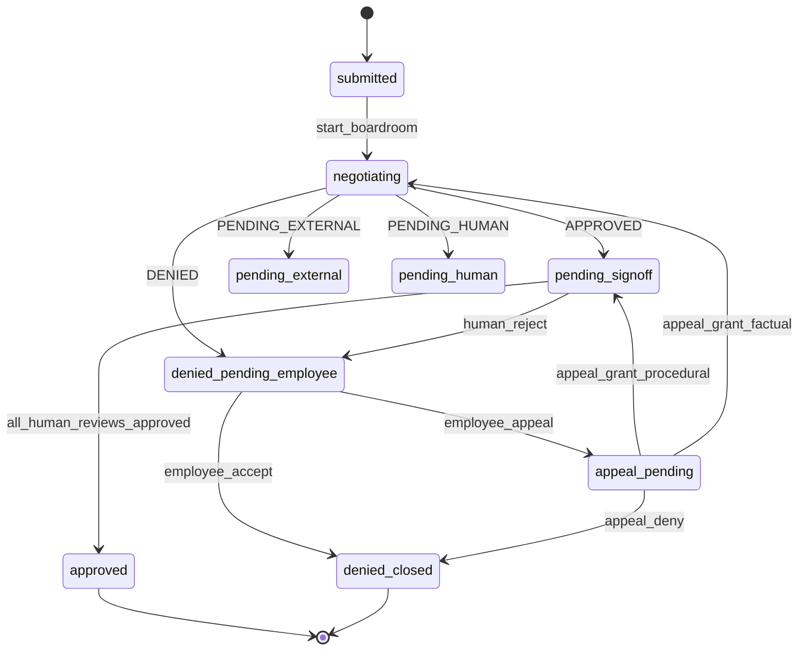

# Technical spec — HITL state model & governance queue APIs

**Status:** Draft v0.1 (2026-07-04)  
**Source PRD:** [`prd_human_in_the_loop_and_negotiation_transparency.md`](./prd_human_in_the_loop_and_negotiation_transparency.md) v0.2  
**Scope:** State representation, transitions, policy activation, human-review records, governance queue HTTP API, audit extensions.  
**Out of scope (later specs):** Advocate Agent chat API (Epic C), employee resolution CTAs (Epic D), UI wire-up.

---

## 1. Design decisions

| # | Decision | Choice | Rationale |
|---|----------|--------|-----------|
| D1 | Status storage | **Orthogonal fields** on `EmployeeRequestRecord` + computed `display_status` | PRD §6.1 MVP option; supports parallel human reviews without combinatorial enum |
| D2 | Policy activation | **`activation_status`** on `StoredPolicy` (`draft` \| `active` \| `revoked`) | Gateway loads policy by id/hash; activation is enforcement gate, not employee UX |
| D3 | Human reviews | **Separate `HumanReviewRecord[]`** per request | Parallel DPO / Procurement / IT tracks; queue filters derive from pending rows |
| D4 | Appeals | **`AppealRecord`** optional child of request | Type-dependent routing (PRD §12.2) needs structured payload |
| D5 | Queue API | **Single list endpoint** + `queue` / `role` query filters | PRD Q1 locked: unified list + role tabs |
| D6 | Reviewer identity (MVP) | **Header `X-Reviewer-Role` + `X-Reviewer-Id`** | No SSO; mirrors governance role switcher. Demo defaults in seed. |
| D7 | Human reject at sign-off | → `denied_pending_employee` | PRD Q2 locked |
| D8 | External gates | Block activation until org/registry gates clear | PRD Q5 locked |

---

## 2. Data model

### 2.1 `EmployeeRequestRecord` (extended)

**File:** `app/shared/types.ts`  
**Store:** `data/employee_requests.json` (unchanged path)

```ts
/** Boardroom terminal outcome — unchanged */
export type SessionOutcome = 'APPROVED' | 'DENIED' | 'PENDING_HUMAN' | 'PENDING_EXTERNAL';

/** Agent phase after boardroom completes */
export type AgentOutcomePhase = SessionOutcome | null;

/** Human parallel-review aggregate */
export type HumanDecisionPhase =
  | 'not_required'   // still negotiating / no draft yet
  | 'pending'        // one or more required reviews open
  | 'complete'       // all required approved
  | 'rejected';      // any required reviewer rejected

/** Employee response on agent deny */
export type EmployeeResolution =
  | 'not_applicable' // approve path or still negotiating
  | 'pending'        // must choose accept | appeal | alternative
  | 'accepted'
  | 'appealed'
  | 'alternative_submitted';

/** Computed for API/UI — not persisted (derived in serializer) */
export type DisplayStatus =
  | 'submitted'
  | 'negotiating'
  | 'agent_recommended_approve'
  | 'pending_signoff'
  | 'approved'
  | 'agent_recommended_deny'
  | 'denied_pending_employee'
  | 'appeal_pending'
  | 'denied_closed'
  | 'pending_external'
  | 'pending_human';

export interface EmployeeRequestRecord {
  // --- existing fields (unchanged names) ---
  request_id: string;
  actor_id: string;
  actor_name: string;
  department: string;
  role: string;
  tool_id: string;
  tool_display_name: string;
  use_case_category: string;
  business_justification?: string;
  packet: RequestPacket;
  session_id?: string;
  submitted_at: string;
  updated_at: string;

  // --- replaces flat `status` (migration maps old → new) ---
  /** @deprecated use display_status; kept for one release as mirror of display_status */
  status?: LegacyEmployeeRequestStatus;

  // --- orthogonal HITL fields (NEW) ---
  negotiation_phase: 'submitted' | 'negotiating' | 'complete';
  agent_outcome?: AgentOutcomePhase;
  human_decision: HumanDecisionPhase;
  employee_resolution: EmployeeResolution;
  policy_activation: 'none' | 'draft' | 'active';

  parent_request_id?: string;
  child_request_ids?: string[];

  outcome?: SessionOutcome; // alias of agent_outcome when complete — keep for compat
  deny_code?: string;
  routing_decision?: string;
  policy_id?: string;
  policy_version_hash?: string;
  transcript_length?: number;
  next_steps?: string[];

  // Advocate (Epic C — fields reserved, populated later)
  advocate_thread_id?: string;
}
```

#### 2.1.1 `display_status` derivation

```ts
function deriveDisplayStatus(r: EmployeeRequestRecord): DisplayStatus {
  if (r.negotiation_phase === 'submitted') return 'submitted';
  if (r.negotiation_phase === 'negotiating') return 'negotiating';

  // negotiation_phase === 'complete'
  if (r.agent_outcome === 'PENDING_EXTERNAL') return 'pending_external';
  if (r.agent_outcome === 'PENDING_HUMAN') return 'pending_human';

  if (r.employee_resolution === 'appealed') {
    return r.human_decision === 'pending' ? 'appeal_pending' : /* resolved below */;
  }
  if (r.employee_resolution === 'accepted' || r.human_decision === 'rejected' && r.employee_resolution !== 'pending') {
    if (r.policy_activation !== 'active' && (r.employee_resolution === 'accepted' || r.human_decision === 'rejected')) {
      return 'denied_closed';
    }
  }

  if (r.agent_outcome === 'DENIED') {
    if (r.employee_resolution === 'pending') return 'denied_pending_employee';
    if (r.employee_resolution === 'accepted') return 'denied_closed';
    if (r.employee_resolution === 'appealed') return 'appeal_pending';
    return 'denied_pending_employee';
  }

  if (r.agent_outcome === 'APPROVED') {
    if (r.policy_activation === 'active' && r.human_decision === 'complete') return 'approved';
    if (r.human_decision === 'pending' || r.policy_activation === 'draft') return 'pending_signoff';
    return 'agent_recommended_approve';
  }

  return 'submitted';
}
```

**API rule:** Every employee/governance response that includes a request **must** include `display_status` (computed server-side). Clients should prefer `display_status` over legacy `status`.

---

### 2.2 `StoredPolicy` (extended)

**File:** `app/backend/src/store/index.ts`

```ts
export type PolicyActivationStatus = 'draft' | 'active' | 'revoked';

export interface StoredPolicy {
  policy: PolicyArtifact;
  policy_version_hash: string;
  activation_status: PolicyActivationStatus;
  request_id: string;
  activated_at?: string;       // ISO-8601
  activated_by_reviewer_ids?: string[];
}
```

**Rules:**

| Event | `activation_status` |
|-------|---------------------|
| Boardroom compiles policy | `draft` |
| All required human reviews approved + external gates clear | `active` |
| Human reject / revoke | `revoked` (gateway treats as `draft` for deny code) |

**Gateway:** `POST /v1/inference` returns **403** `{ deny_reason_code: "POLICY_NOT_ACTIVATED" }` when `activation_status !== 'active'`.

---

### 2.3 `HumanReviewRecord`

**Store:** `data/human_reviews.json` (new file, array)

```ts
export type ReviewerRole = 'dpo' | 'procurement' | 'it';

export type HumanReviewStatus = 'pending' | 'approved' | 'rejected';

export interface HumanReviewRecord {
  review_id: string;           // uuid
  request_id: string;
  reviewer_role: ReviewerRole;
  reviewer_id: string;         // e.g. katrin.mueller@demo.de
  reviewer_display_name: string;
  status: HumanReviewStatus;
  rationale?: string;          // required on approve/reject (min 20 chars)
  rationale_hash?: string;     // sha256(normalized rationale)
  created_at: string;
  decided_at?: string;
  required: boolean;           // false = informational only (future)
}
```

#### 2.3.1 Required reviewers matrix

Computed at boardroom complete (after external gates if any):

| Role | Required when |
|------|----------------|
| `dpo` | Always |
| `procurement` | `packet.vendor_dpa_status !== 'signed'` OR procurement agent hard demand in transcript |
| `it` | Always |

Works council: **never** an in-app review row — `pending_external` until `betriebsvereinbarung_status === 'signed'`.

**Activation predicate:**

```
can_activate(request, reviews, org, registry) :=
  external_gates_clear(request, org, registry)
  AND all required reviews have status === 'approved'
```

---

### 2.4 `AppealRecord`

**Store:** `data/appeals.json` (new file)

```ts
export type AppealType =
  | 'procedural'
  | 'factual'
  | 'alternative_scope'
  | 'wrong_tool';  // UX guardrail — should redirect to propose-alternative

export type AppealStatus = 'pending' | 'granted' | 'denied';

export interface AppealRecord {
  appeal_id: string;
  request_id: string;
  actor_id: string;
  appeal_type: AppealType;
  statement: string;
  status: AppealStatus;
  chair_reviewer_id?: string;   // default DPO
  decision_rationale?: string;
  submitted_at: string;
  decided_at?: string;
  /** Set on grant — next automation step */
  grant_routing?: 'human_reviews' | 'reopen_boardroom';
}
```

---

## 3. State transitions

### 3.1 Boardroom completion (`runEmployeeBoardroom`)

Replace `statusFromOutcome` mapping:

| `SessionOutcome` | `negotiation_phase` | `agent_outcome` | `human_decision` | `employee_resolution` | `policy_activation` | Side effects |
|------------------|---------------------|-----------------|------------------|----------------------|---------------------|--------------|
| `APPROVED` | `complete` | `APPROVED` | `pending`* | `not_applicable` | `draft` | Write policy `draft`; spawn human review rows |
| `DENIED` | `complete` | `DENIED` | `not_required` | `pending` | `none` | No policy or invalid draft discarded |
| `PENDING_EXTERNAL` | `complete` | `PENDING_EXTERNAL` | `not_required` | `not_applicable` | `draft`?** | May compile draft; activation blocked |
| `PENDING_HUMAN` | `complete` | `PENDING_HUMAN` | `pending` | `not_applicable` | `none` | Human tie-break queue (no employee CTAs) |

\* If external gate blocks, stay `human_decision: not_required` until gate clears, then spawn reviews.  
\** Draft optional when external only — MVP: compile draft so procedural appeal can skip re-boardroom.

**Removed behavior:** `APPROVED` → `status: approved` (gateway live). That path is deleted.

### 3.2 Human sign-off (`POST .../reviews/:reviewId/decide`)

| Action | Preconditions | Result |
|--------|---------------|--------|
| `approve` | review `pending`; rationale ≥ 20 chars | review → `approved`; if `can_activate` → policy `active`, `human_decision: complete`, `display_status: approved` |
| `reject` | review `pending`; rationale ≥ 20 chars | review → `rejected`; request → `human_decision: rejected`, `employee_resolution: pending`, `display_status: denied_pending_employee` |

**Parallelism:** Any order; activation only when **all** required reviews `approved`.

**Optional demo ceremony:** `POST /v1/governance/requests/:id/activate` — no-op if already active; else activates when `can_activate` (DPO "release to gateway" button).

### 3.3 Employee resolution (Epic D — API stubbed here)

| Action | Endpoint | Result |
|--------|----------|--------|
| Accept deny | `POST /v1/employee/requests/:id/accept-deny` | `employee_resolution: accepted`, `display_status: denied_closed` |
| Appeal | `POST /v1/employee/requests/:id/appeal` | Create `AppealRecord`; `employee_resolution: appealed`, `display_status: appeal_pending` |
| Propose alternative | `POST /v1/employee/requests/:id/propose-alternative` | New request with `parent_request_id`; `employee_resolution: alternative_submitted` |

### 3.4 Appeal decision (`POST /v1/governance/appeals/:id/decide`)

| `appeal_type` | Grant | Deny |
|---------------|-------|------|
| `procedural` | Refresh org gate if evidence attached; spawn/continue human reviews; `grant_routing: human_reviews` | `denied_closed` |
| `factual` | `reopen_boardroom` (new session, packet += evidence) | `denied_closed` |
| `alternative_scope` | `reopen_boardroom` with scoped packet | `denied_closed` |
| `wrong_tool` | 400 + nudge to propose-alternative | — |

### 3.3 Transition diagram (simplified)



---

## 4. Governance queue API

**Base path:** `/v1/governance`  
**Auth (MVP):** Optional headers on mutating routes:

| Header | Example | Purpose |
|--------|---------|---------|
| `X-Reviewer-Id` | `katrin.mueller@demo.de` | Audit `human_reviewer_id` |
| `X-Reviewer-Role` | `dpo` | Authorize role-scoped actions |
| `X-Reviewer-Name` | `Katrin Müller` | Display only |

Default when omitted: demo DPO persona (same as governance UI today).

---

### 4.1 `GET /v1/governance/queues`

Unified queue list with filters (PRD Epic E1).

**Query parameters:**

| Param | Type | Description |
|-------|------|-------------|
| `queue` | enum | `all` (default), `signoff`, `appeals`, `external`, `in_review`, `negotiating` |
| `role` | enum | `all` (default), `dpo`, `procurement`, `it` — filters sign-off items to that role's pending review |
| `status` | enum | Optional: `pending`, `approved`, `rejected` (review row status) |
| `limit` | int | Default 50, max 200 |
| `offset` | int | Pagination |

**Response:**

```json
{
  "queue": "signoff",
  "role": "dpo",
  "total": 3,
  "items": [
    {
      "kind": "signoff",
      "request_id": "…",
      "display_status": "pending_signoff",
      "actor_name": "Alex Chen",
      "tool_display_name": "Claude Code",
      "department": "Payments",
      "compliance_score": 82,
      "agent_outcome": "APPROVED",
      "policy_id": "pol_…",
      "policy_activation": "draft",
      "submitted_at": "…",
      "pending_review": {
        "review_id": "…",
        "reviewer_role": "dpo",
        "status": "pending"
      },
      "reviews_summary": {
        "dpo": "pending",
        "procurement": "approved",
        "it": "pending"
      },
      "external_gates": {
        "betriebsvereinbarung_status": "signed",
        "vendor_dpa_status": "signed",
        "blocking": false
      }
    }
  ]
}
```

**Item kinds:**

| `kind` | Included when `queue=` |
|--------|------------------------|
| `signoff` | `signoff`, `all` |
| `appeal` | `appeals`, `all` |
| `external` | `external`, `all` |
| `in_review` | `in_review`, `negotiating`, `all` |

**Filter logic (normative):**

- `queue=signoff` → `display_status === 'pending_signoff'` OR (`appeal_pending` with grant routing human_reviews)
- `queue=appeals` → `display_status === 'appeal_pending'`
- `queue=external` → `display_status === 'pending_external'`
- `queue=in_review` → `negotiating` \| `pending_human`
- `role=dpo` → items where DPO review `status === 'pending'` (or appeal chair default DPO)

---

### 4.2 `GET /v1/governance/overview` (extended)

Keep existing shape; extend `stats`:

```json
{
  "stats": {
    "total_requests": 12,
    "in_review": 2,
    "pending_signoff": 3,
    "appeals_pending": 1,
    "pending_external": 1,
    "approved": 4,
    "denied_closed": 1,
    "policies_compiled": 8,
    "policies_active": 4,
    "audit_events": 120
  }
}
```

Remove reliance on flat `status === 'approved'` for "blocked" counts; use `display_status`.

---

### 4.3 `GET /v1/governance/requests/:id` (extended)

Add to response:

```json
{
  "record": { "...": "includes display_status" },
  "human_reviews": [ "HumanReviewRecord[]" ],
  "appeal": "AppealRecord | null",
  "activation": {
    "policy_activation": "draft",
    "can_activate": false,
    "blocking_reasons": ["procurement_review_pending"]
  },
  "session": { "...": "unchanged" },
  "policy": { "...": "includes activation_status" },
  "audit": []
}
```

---

### 4.4 `POST /v1/governance/requests/:id/reviews/:reviewId/decide`

**Body:**

```json
{
  "decision": "approve",
  "rationale": "DPA on file; routing to EU-local model acceptable for payment schemas."
}
```

**Validation:**

- `rationale` length ≥ 20 after trim
- Review belongs to request and is `pending`
- `X-Reviewer-Role` matches `review.reviewer_role` (or `dpo` may act as chair on appeals only)

**Response:** `{ record, human_reviews, activation, audit_event_id }`

**Side effects:**

1. Update `HumanReviewRecord`
2. If `can_activate`: set `StoredPolicy.activation_status = 'active'`, `request.policy_activation = 'active'`, `human_decision = 'complete'`
3. Append audit event `event_type: human_sign_off`

---

### 4.5 `POST /v1/governance/requests/:id/activate`

Idempotent activation when `can_activate` true. Emits `human_sign_off` (final) audit event. For demo "Release to gateway" button.

---

### 4.6 `POST /v1/governance/appeals/:id/decide`

**Body:**

```json
{
  "decision": "grant",
  "rationale": "BR annex 2024-17 signed 12 June — registry updated.",
  "registry_patch": {
    "betriebsvereinbarung_status": "signed"
  }
}
```

**Side effects:** Per §3.4; audit `event_type: appeal_decision`.

---

### 4.7 `GET /v1/governance/requests/:id/export`

Stub auditor export (Epic E4): JSON bundle of request + reviews + appeal + transcript + policy hash + human decisions.

---

## 5. Employee API touchpoints (read path)

| Route | Change |
|-------|--------|
| `GET /v1/employee/requests` | Include `display_status`; filter helpers for dashboard badges |
| `GET /v1/employee/requests/:id` | Include `display_status`, `policy_activation`, hide governance-only fields |

No employee access to `human_reviews` rows (only aggregate "waiting for DPO sign-off").

---

## 6. Audit schema extensions

**File:** `docs/schemas/gateway-audit-event.schema.json`

Add to `event_type` enum:

```json
"human_sign_off",
"appeal_decision",
"policy_activated"
```

Add optional fields:

```json
"request_id": { "type": "string", "format": "uuid" },
"reviewer_role": { "type": "string", "enum": ["dpo", "procurement", "it"] },
"rationale_hash": { "type": "string" },
"appeal_id": { "type": "string", "format": "uuid" },
"appeal_type": { "type": "string" }
```

Add to `deny_reason_code` examples: `POLICY_NOT_ACTIVATED`.

**Normative event payloads:**

| Event | Required fields |
|-------|-----------------|
| `human_sign_off` | `request_id`, `human_reviewer_id`, `reviewer_role`, `rationale_hash`, `policy_id`, `policy_version_hash` |
| `appeal_decision` | `request_id`, `appeal_id`, `human_reviewer_id`, `outcome` (granted/denied) |
| `policy_activated` | `request_id`, `policy_id`, `policy_version_hash`, `human_reviewer_id` |

---

## 7. Migration from current model

One-time script `scripts/migrate_hitl_status.ts` (or inline on boot):

| Old `status` | New fields |
|--------------|------------|
| `submitted` | `negotiation_phase: submitted`, others default |
| `negotiating` | `negotiation_phase: negotiating` |
| `approved` | `negotiation_phase: complete`, `agent_outcome: APPROVED`, `human_decision: complete`, `policy_activation: active`, backfill reviews as `approved` |
| `denied` | `negotiation_phase: complete`, `agent_outcome: DENIED`, `employee_resolution: accepted` (legacy = terminal deny) |
| `pending_external` | `agent_outcome: PENDING_EXTERNAL` |
| `pending_human` | `agent_outcome: PENDING_HUMAN`, `human_decision: pending` |

Policies on disk without `activation_status`: if parent request `approved` → `active`, else `draft`.

---

## 8. Implementation map

| Layer | Files | Epic |
|-------|-------|------|
| Types | `app/shared/types.ts` | B |
| Stores | `app/backend/src/store/humanReviews.ts`, `appeals.ts`, extend `store/index.ts` | B |
| State machine | `app/backend/src/employee/requestState.ts` (derive + transition helpers) | B |
| Boardroom hook | `app/backend/src/employee/runBoardroom.ts` | B |
| Gateway gate | `app/backend/src/gateway/inference.ts` | B |
| Routes | `app/backend/src/server.ts` — queue + decide endpoints | B, E |
| Web client | `app/web/src/governance/api.ts`, queue pages | E |
| Schema | `docs/schemas/gateway-audit-event.schema.json` | E |
| Tests | `app/backend/src/employee/requestState.test.ts`, integration S04 sign-off path | B |

**Suggested PR sequence:**

1. Types + `requestState` + migration + boardroom hook (no UI)
2. `GET /queues` + extended overview/detail (read-only)
3. `POST decide` + gateway `POLICY_NOT_ACTIVATED`
4. Appeal routes + employee resolution stubs
5. Governance UI tabs wired to `GET /queues`

---

## 9. Acceptance criteria (spec-level)

| # | Criterion |
|---|-----------|
| AC1 | Boardroom `APPROVED` never sets `policy_activation: active` without human review rows |
| AC2 | `POST /v1/inference` with draft policy returns 403 `POLICY_NOT_ACTIVATED` |
| AC3 | `GET /v1/governance/queues?queue=signoff&role=dpo` returns only requests with pending DPO review |
| AC4 | All three roles approving activates policy and sets `display_status: approved` |
| AC5 | Human reject sets `display_status: denied_pending_employee` (not terminal) |
| AC6 | Every `approve`/`reject` appends `human_sign_off` audit with `rationale_hash` |
| AC7 | S04 eval scenario: end state `pending_signoff` until scripted DPO approve |

---

## 10. Open questions (non-blocking)

| # | Question | Default for MVP |
|---|----------|-----------------|
| Q1 | Persist `display_status` for querying vs always derive? | Derive only (simpler) |
| Q2 | Single `employee_requests.json` vs split reviews file? | Split files (smaller diffs) |
| Q3 | Procurement "agent hard demand" detection | Keyword scan on procurement agent final turn; else `vendor_dpa_status` only |

---

*End of spec v0.1 — ready for Epic B implementation.*
