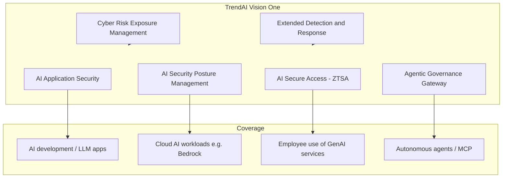

# R6a — Competitor analysis: TrendAI (Trend Micro enterprise)

**Status:** v1 desk research (2026-06-30)  
**Scope:** AI security & compliance features, UX patterns, inspiration for TrustFlow  
**Method:** Public website, product docs, AWS partner blog, press releases — no vendor demo

---

## 1. Who they are

| Field | Detail |
|-------|--------|
| **Brand** | TrendAI™ — enterprise cybersecurity business unit of **Trend Micro Incorporated** (TSE: 4704) |
| **Rebrand** | Trend Micro enterprise business repositioned as “world’s #1 AI security company” (2026) |
| **Primary site** | [trendaisecurity.com](https://www.trendaisecurity.com/) |
| **Platform** | **TrendAI Vision One™** — unified cyber risk, SOC, endpoint/cloud/network/data protection |
| **Buyer** | CISO, security operations, cloud security teams at Fortune 500 / global enterprises |
| **Geo** | Global (185 countries); strong AWS/GCP/Azure marketplace presence |

**Note for TrustFlow:** TrendAI is **not** a governance-boardroom or EU-regulatory-workflow product. It is a **security platform** that added AI-specific modules. Overlap with TrustFlow is at the **gateway / runtime enforcement** layer, not stakeholder negotiation.

---

## 2. Product map (AI-relevant modules)

| Module | What it does | TrustFlow analog |
|--------|--------------|------------------|
| **AI-SPM** | Discover AI assets, misconfigs, shadow AI in cloud | Tool registry + shadow discovery (partial) |
| **AI Secure Access (ZTSA)** | Inline inspect/block of prompts & responses to public/private GenAI | **Layer A gateway** — closest competitor feature |
| **AI Application Security** | AI Scanner (pre-deploy) + AI Guard (runtime) for custom LLM apps | Gateway pre/post-flight checks |
| **Agentic Governance Gateway** (Mar 2026) | Visibility & policy over agent-to-agent / agent-to-tool interactions; human-in-the-loop | Boardroom + gateway for agentic use cases |
| **MCP Guard** | Govern public MCP server access with content inspection | Future: tool-call governance |
| **Claude Compliance API collector** | Out-of-band log ingest when inline controls impossible | Fallback integration pattern |
| **Conformity / compliance reports** | PASS/FAIL vs cloud frameworks (GDPR, HIPAA, Well-Architected) | Different layer — infra compliance, not AI policy negotiation |
| **LLM Red Teaming** | Pen-test service for LLM apps | Out of scope for MVP |

**Sources:** [Proactive AI Security](https://www.trendaisecurity.com/en-gb/platform/proactive-ai-security), [AI Secure Access](https://www.trendmicro.com/en/business/products/network/zero-trust-secure-access/ai.html), [Bedrock + AI-SPM blog](https://aws.amazon.com/blogs/awsmarketplace/detecting-misconfigurations-and-mitigating-ai-risks-to-secure-amazon-bedrock-with-trendai-vision-one/), [Agentic Governance Gateway PR](https://newsroom.trendmicro.com/2026-03-24-TrendAI-TM-Secures-the-OpenClaw-Driven-AI-Era), [AI service access rule docs](https://servicecentral-prod.trendmicro.com/en-us/documentation/article/trend-vision-one-ai-service-access-rule)

---

## 3. Security & compliance feature depth

### 3.1 Employee GenAI governance (AI Secure Access)

Administrators create **AI secure access rules** scoped by user, group, device, and service allowlist.

**Prompt-side controls:**

- Sensitive data loss detection (DLP on prompts & uploads)
- Prompt injection detection (monitor or block)
- Harmful prompt categories (monitor or block)

**Response-side controls:**

- Inappropriate content filtering
- Malicious URL blocking in model output

**Access modes:**

- Block all supported AI services
- Allow with advanced content inspection (per-service)
- Public MCP server access with same inspection stack

**UX pattern:** Security console → rule wizard → assign to identity groups → monitor/block granularity per threat type. Feels like **firewall policy for AI**, not a legal workflow.

### 3.2 Shadow AI & discovery

- **AI-SPM** scans cloud accounts for Bedrock, exposed models, excessive permissions
- **Employee layer** identifies unapproved AI service use
- Narrative: “Map usage across applications, models, data sources, APIs, and employees”

### 3.3 Agentic / MCP era (2026 push)

**Agentic Governance Gateway** capabilities (press release):

- Visibility into agent interactions across systems
- Intent/context analysis for risky actions
- Policy enforcement on agent-driven actions
- **Human oversight at critical decision points**

Partnership angle: NVIDIA DOCA / agent runtime integration for OpenClaw-era agents.

### 3.4 Compliance positioning

TrendAI maps product features to **OWASP Top 10 for LLM Applications** (e.g. prompt injection → ZTSA + AI Guard). Cloud **Conformity reports** score infrastructure against GDPR/HIPAA/etc. with PASS/FAIL and remediation links.

**Gap vs TrustFlow:** No EU AI Act deployer workflow, no Betriebsrat, no procurement DPA gate, no multi-stakeholder policy *authoring* — compliance is **technical control + cloud posture**, not organizational negotiation.

### 3.5 Out-of-band governance pattern (Claude Enterprise)

When inline proxy is not feasible, TrendAI offers a **self-hosted collector** that:

1. Pulls Claude Enterprise logs via Compliance API
2. Runs AI Application Security analysis locally
3. Feeds detections into Vision One / XDR

**Key UX promise:** “Visibility without changing how people work.” Content stays in customer infrastructure until analysis.

*Source:* [Governing Claude Enterprise research note](https://www.trendmicro.com/en/research/26/f/governing-claude-enterprise.html) (public summary via search; full page fetch timed out)

---

## 4. User experience observations

| Surface | Pattern | Friction |
|---------|---------|----------|
| **Marketing** | “AI Fearlessly” — security as **innovation enabler**, not blocker | Enterprise sales-led; free trial for platform |
| **Admin UX** | Unified Vision One console; AI rules nested under ZTSA / AI Security | Steep — full XDR platform, not a single-purpose AI approval tool |
| **Employee UX** | Inline block/warn at access layer; user may not see *why* beyond security message | No employee-facing “request access” story |
| **Policy model** | Allow/block/monitor per inspection type | Deterministic — aligns with TrustFlow Layer A philosophy |
| **Evidence** | Interaction logging for compliance & investigations | Audit trail yes; legal artifact generation no |
| **Integrations** | AWS Marketplace, SIEM, Claude Compliance API, MCP | Strong infra ecosystem |

**Demo / trial:** Platform free trial; AI modules bundled into Vision One licensing — not transparent self-serve for SMB.

---

## 5. Strengths vs TrustFlow

| TrendAI strength | Why it matters |
|------------------|----------------|
| Mature inline enforcement at scale | Production-grade DLP + prompt inspection |
| Shadow AI + cloud AI-SPM | Addresses R3 `shadow_ai` theme |
| OWASP LLM mapping | Clear buyer language for CISO |
| Agentic Governance Gateway | Validates market pull for agent oversight + HITL |
| Out-of-band collectors | Practical when vendor won’t sit behind your proxy |
| Global threat intel + XDR correlation | Risk-based adaptive policies |

---

## 6. Gaps TrustFlow can exploit

| Gap | TrustFlow response |
|-----|-------------------|
| No **stakeholder boardroom** (Legal, DPO, BR, Procurement) | Layer B agent society |
| No **DE Betriebsvereinbarung** first-class gate | `BETRIEBSVEREINBARUNG_PENDING` deny code |
| No **employee-initiated access request** narrative | Request UI → boardroom → compiled policy |
| Compliance = cloud infra + DLP, not **EU AI Act deployer duties** as workflow | R1 audit fields + limited/high-risk tiering |
| Heavy platform — **weeks to value** for “approve Copilot for Team X” | Docker MVP / focused wedge |
| Policy set by **security admin only** | Cross-functional negotiation output |

---

## 7. Inspiration candidates for TrustFlow (prioritized)

| ID | Idea from TrendAI | TrustFlow action |
|----|-------------------|------------------|
| T1 | **Inspection rule matrix** (prompt injection / PII / harmful / URL) | Add matching `deny_reason` subcodes & admin rule templates in gateway MVP |
| T2 | **Out-of-band collector** for tools without inline proxy | Document “Compliance API ingest” as Phase 2 integration in architecture |
| T3 | **OWASP LLM Top 10** coverage table on marketing / demo | One-pager mapping gateway checks → OWASP rows |
| T4 | **Shadow AI discovery** feed into Tool Registry | Flag `TOOL_NOT_APPROVED` when shadow usage detected |
| T5 | **Human-in-the-loop** on agent tool calls | Boardroom `PENDING_HUMAN` + gateway hold on high-risk agent actions |
| T6 | **“AI Fearlessly”** framing | Mirror: “Approve AI responsibly” — speed *with* gates, not security vs innovation |

---

## 8. Open validation items

- [ ] Pricing / packaging for AI Secure Access vs full Vision One (sales call or Gartner peer review)
- [ ] Live demo of Agentic Governance Gateway rule UX (COMPUTEX / RSA materials)
- [ ] Whether TrendAI plans EU AI Act-specific deployer workflows (none public as of 2026-06-30)
- [ ] DE enterprise reference customers for employee AI governance

---

*Next:* [`05_competitor_naaia.md`](05_competitor_naaia.md) · Synthesis: [`06_competitor_inspiration_for_trustflow.md`](06_competitor_inspiration_for_trustflow.md)
