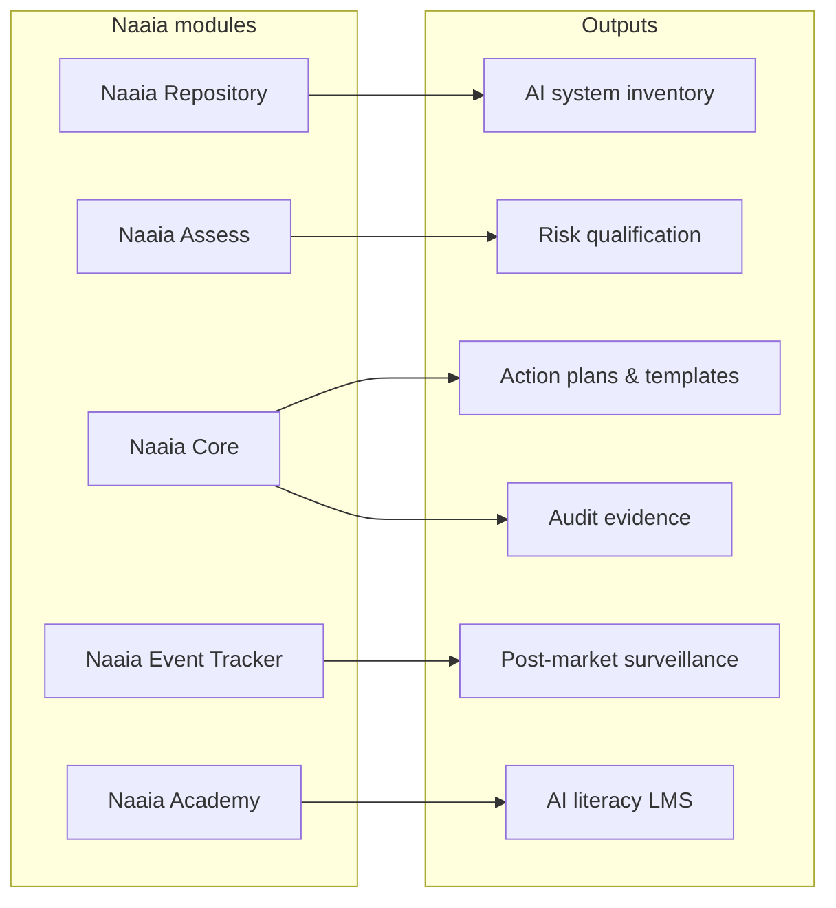

# R6b — Competitor analysis: Naaia

**Status:** v1 desk research (2026-06-30)  
**Scope:** AI governance & compliance features, UX patterns, inspiration for TrustFlow  
**Method:** Public website, Azure Marketplace support PDF, third-party vendor comparison — no vendor demo

---

## 1. Who they are

| Field | Detail |
|-------|--------|
| **Company** | Naaia — European AI Management System (AIMS®) vendor |
| **Founded** | 2021 (lawyers + regulated-industry background) |
| **HQ** | Louveciennes, France |
| **Site** | [naaia.ai](https://naaia.ai/en/) |
| **Certifications** | ISO/IEC 42001, ISO 27001; regulatory content validated with external law firm |
| **Funding** | ~$1.4M seed (2024) per [vendor comparison site](https://aicompliancevendors.com/compare/enzai-vs-naaia) |
| **Buyer** | DPO, compliance, legal, AI governance leads in EU enterprises & public sector |
| **Positioning** | “Europe’s first AIMS” — turn regulations into **operational action** |

**Note for TrustFlow:** Naaia is the closest **EU regulatory workflow** competitor. It owns **documentation, qualification, and audit readiness** — not inline inference enforcement. Overlap with TrustFlow is at **policy lifecycle & evidence**, not the gateway proxy.

---

## 2. Product map (modular platform)

| Module | Function | TrustFlow analog |
|--------|----------|------------------|
| **Repository** | Single source of truth: projects, systems, models, components, stakeholders, docs | Tool registry + policy store metadata |
| **Assess** | Qualification engine: regulations, operator role, risk level, privacy, IP | Compliance agent risk tier + Annex III classification |
| **Core** | Generates **action plans** (list/map) from all applicable frameworks; “Mix & Match” actions across regs | Boardroom → Policy Proposal → compiler (we add **executable** rules) |
| **Event Tracker** | Lifecycle events, incidents, post-market monitoring; upstream/downstream stakeholder visibility | Audit log + `PENDING_EXTERNAL` workflows |
| **Academy** | Integrated LMS for AI literacy training | Art. 4 literacy — out of MVP scope |
| **Dashboards** | Compliance score, KPIs, customized reports | Admin UI metrics post-boardroom |

**Frameworks cited:** EU AI Act, ISO/IEC 42001, NIST AI RMF, GDPR Art. 22 (partial), internal/customer frameworks, multi-jurisdiction (EU, US state bills, etc.)

**Sources:** [naaia.ai/en](https://naaia.ai/en/), [Azure Marketplace PDF](https://catalogartifact.azureedge.net/publicartifacts/naaia.a9209302-179d-4236-9436-57bcd91625e7-fc830a08-ed76-437a-b23f-2b5a2e6dfb7d/Artifacts/Documents/supportdoc0.pdf), [AI inventory blog](https://naaia.ai/en/ai-mapping-governance-compliance/)

---

## 3. Security & compliance feature depth

### 3.1 Qualification engine (Naaia Assess)

Proprietary algorithm scores each AI asset on:

- Applicable regulations (auto-updated when law changes)
- **Operator status** (provider / deployer / distributor per AI Act)
- **Risk level** (incl. high-risk under EU AI Act)
- Privacy & intellectual property exposure

**Product claim:** Global regulations + standards (ISO 42001, NIST AI RMF, LNE) integrated into one engine.

**TrustFlow parallel:** Boardroom input packet `use_case.annex_iii_risk` + Compliance agent — but Naaia is **form-driven & persistent**, not conversational negotiation.

### 3.2 Compliance engine → action plans (Naaia Core)

- Converts legal obligations into **concrete tasks** with pre-built templates
- **Core Actions:** obligations shared across all AI systems deduplicated once
- **Mix & Match:** one completed action propagates compliance index across multiple frameworks
- Platform team updates templates when regulations evolve (“you don’t have to worry”)

**UX pattern:** Compliance as **project management** — checklist with % complete, not real-time prompt blocking.

### 3.3 Continuous governance

Five components Naaia advertises (maps cleanly to EU AI Act deployer duties):

1. Live AI system inventory
2. Automated monitoring for drift (behavior, output quality, usage)
3. Periodic review cycles (quarterly high-risk, annual lower-risk) — **Art. 9 post-market surveillance**
4. Incident management process
5. Regulatory update mechanism with SLA to translate new guidance

**Claim:** 50–70% reduction in compliance documentation time vs spreadsheets.

### 3.4 Event Tracker (post-market)

- Report incidents & malfunctions
- Notify suppliers, distributors, deployers, users (bidirectional)
- Supports vigilance / corrective action decisions

### 3.5 “Real-time policy enforcement” (marketing vs architecture)

Website states *“Automated real time policy enforcement & continuous monitoring.”* Public materials emphasize **documentation, alerts, and evidence** — not a described HTTP proxy. Treat **runtime enforcement as hypothesis** until demo confirms technical control plane.

**TrustFlow differentiation:** We commit to **deterministic gateway enforcement** (Layer A) — Naaia appears stronger on **audit-ready paperwork**.

### 3.6 Auditor experience

- External auditors get portal access
- Versioned action plans & proofs
- Dynamic dashboards for compliance score

---

## 4. User experience observations

**Visual reference:** UI fragments from marketing Lotties in [`competitors/naaia/`](../competitors/naaia/) · index [`competitors/README.md`](../competitors/README.md). **No public full-console screenshots** — demo-only product.

| Surface | Pattern | Notes |
|---------|---------|-------|
| **Marketing** | “Govern AI risks. Build Trusted AI.” / “Compliance as a **Great experience**” | EU-first, trust & certification badges |
| **Segmentation** | Enterprise / Public sector / SME tiers | Same platform, scaled narrative |
| **Primary CTA** | “Get a demo” / “Talk to an expert” — **no self-serve** | 30-min personalized walkthrough |
| **Onboarding story** | Register AI products → Assess → Core action plan → Track events | Linear lifecycle, not employee request |
| **Action card UX** | Date + assignee avatars + EU AI Act chip + linked obligation count | See `01-action-plan-card-impact-assessment.png` |
| **Task / evidence UX** | Green Done pill + “Applicable on N products” scope label | See `02-compliance-task-done-badge.png` |
| **Registry UX** | Per-asset progress bar (70%) with Provider + High-risk labels | See `03-registry-eu-ai-act-progress-70pct.png` |
| **Language** | English + French; strong EU AI Act vocabulary | Good reference for TrustFlow copy |
| **Integrations** | “Technology-agnostic, ecosystem-integrated”, strong API (Azure listing) | Interop without owning the proxy |
| **Pricing** | Opaque — quote via sales | Typical enterprise GRC |

**Demo request form fields:** Name, email, company, free-text needs — minimal friction, high-touch follow-up.

---

## 5. Strengths vs TrustFlow

| Naaia strength | Why it matters |
|----------------|----------------|
| **ISO 42001-native AIMS** | Credibility with DPO / audit |
| **Qualification engine** | Automates “which rules apply to this system?” |
| **Action plan + templates** | Reduces blank-page problem for compliance teams |
| **Multi-framework Mix & Match** | Efficient for multinationals |
| **Regulatory auto-update** | Ongoing value prop vs static policy docs |
| **Event Tracker / Art. 9** | Post-market surveillance as product, not afterthought |
| **Auditor portal** | Closes “prove it” loop for enterprises |
| **Academy (LMS)** | AI literacy as attached revenue / duty |

---

## 6. Gaps TrustFlow can exploit

| Gap | TrustFlow response |
|-----|-------------------|
| Weak public evidence of **inline enforcement** | Gateway with deny/allow at inference time |
| No **multi-agent stakeholder negotiation** | Boardroom simulates DPO vs IT vs BR debate |
| No **Betriebsrat / §87 BetrVG** specificity | Works Council Liaison agent + gate |
| **Employee access request** not center stage | Runner-initiated flow — “I need Claude for payments” |
| **Procurement / DPA** not prominent in modules | Procurement agent + `VENDOR_DPA_PENDING` |
| Speed to **approved tool use** vs speed to **audit binder** | Wedge: weeks of approval → hours with compiled policy |
| DE labor law invisible in Naaia marketing | R2 research as moat |

---

## 7. Inspiration candidates for TrustFlow (prioritized)

| ID | Idea from Naaia | TrustFlow action |
|----|-----------------|------------------|
| N1 | **Qualification wizard** on tool register | Pre-boardroom form: operator role, risk tier, data classes |
| N2 | **Action plan output** from boardroom | Policy Proposal includes human tasks + machine rules side-by-side |
| N3 | **Core Actions** deduplication | Org-wide obligations (e.g. AI literacy) once, linked to many tools |
| N4 | **Compliance score dashboard** | Post-negotiation % complete: DPA ✓, BR pending, gateway live |
| N5 | **Mix & Match frameworks** | Single gateway rule satisfies GDPR minimization + Art. 50 disclosure |
| N6 | **Event Tracker** pattern | Extend audit schema with `incident_id`, corrective_action_status |
| N7 | **Auditor read-only view** | Export versioned policy hash + boardroom transcript + sample logs |
| N8 | **“Compliance as great experience”** | Demo UI: celebrate progress, not only blocks |
| N9 | **Regulatory update feed** | Compliance agent system prompt versioned when R1 ledger changes |
| N10 | **50–70% time saved** claim | Measure: time from request → approved policy in pilot scenarios |

---

## 8. Comparison to adjacent EU vendors (context)

Per [Enzai vs Naaia comparison](https://aicompliancevendors.com/compare/enzai-vs-naaia) (verify independently):

- **Enzai** (Belfast): AI governance & enablement; similar framework coverage; less GDPR Art. 22 / ISO 27001 emphasis in matrix
- **Naaia** unique coverage called out: GDPR Art. 22, ISO 27001 adjacent

TrustFlow should **not** compete on full AIMS breadth at MVP — compete on **cross-functional approval → enforced policy** wedge.

---

## 9. Open validation items

- [ ] Book Naaia demo — confirm whether “real-time enforcement” is proxy, API webhook, or monitoring-only
- [ ] Inspect Repository → Assess → Core UX flow (screenshots / recording)
- [ ] Ask whether Betriebsrat / works council workflows exist in DE deployments
- [ ] API docs for connecting to existing LLM gateways
- [ ] Pricing model for mid-market vs enterprise

---

*Previous:* [`04_competitor_trendai.md`](04_competitor_trendai.md) · Synthesis: [`06_competitor_inspiration_for_trustflow.md`](06_competitor_inspiration_for_trustflow.md)
