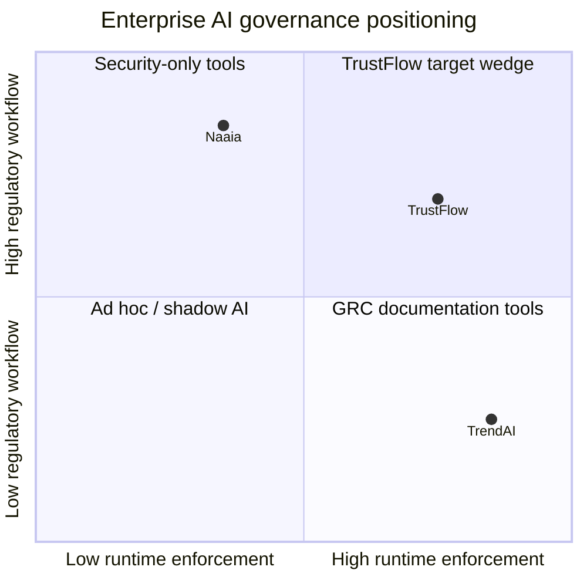

# R6 — Competitor inspiration synthesis (TrendAI + Naaia → TrustFlow)

**Status:** v1 (2026-06-30)  
**Inputs:** [`04_competitor_trendai.md`](04_competitor_trendai.md), [`05_competitor_naaia.md`](05_competitor_naaia.md)  
**Audience:** Product, demo UI, hackathon narrative

---

## 1. Executive summary

TrendAI and Naaia represent two mature poles in the **enterprise AI governance** market:

| Pole | Vendor | Core promise | Buyer | Enforcement |
|------|--------|--------------|-------|-------------|
| **Security** | TrendAI (Trend Micro) | “AI Fearlessly” — block threats, stop leakage, see shadow AI | CISO / SecOps | **Strong** inline (ZTSA, AI Guard) |
| **Compliance** | Naaia | “Trusted AI” — inventory, qualify, document, stay audit-ready | DPO / Legal / GRC | **Weak** in public materials (docs & alerts) |

**TrustFlow wedge:** Be the **bridge** — multi-stakeholder **policy authoring** (Naaia-style obligations + TrendAI-style controls) compiled to **deterministic gateway rules**, with **DE-specific gates** neither competitor emphasizes.

*(Quadrant positions are qualitative desk-research estimates, not market share.)*

---

## 2. Feature matrix (AI security & compliance)

| Capability | TrendAI Vision One | Naaia | TrustFlow (planned) |
|------------|-------------------|-------|---------------------|
| AI asset inventory | AI-SPM (cloud) | Repository (full lifecycle) | Tool registry |
| Shadow AI detection | Yes (employee + cloud) | Indirect (inventory gap) | Registry + deny unapproved |
| Prompt / PII DLP | AI Secure Access | Not demonstrated | Gateway pre-flight |
| Prompt injection block | Yes | Not demonstrated | Gateway rule table |
| Agent / MCP governance | Agentic Gateway, MCP Guard | Not emphasized | Future + boardroom HITL |
| EU AI Act risk classification | Not productized | Assess engine | Compliance agent |
| Multi-framework action plans | Cloud conformity only | Core + templates | Boardroom → compiler |
| Post-market surveillance | XDR / logging | Event Tracker | Audit log + incidents |
| Human oversight workflow | HITL on agent actions | Review cycles | `PENDING_HUMAN`, BR gate |
| Betriebsrat / works council | No | No | **Works Council Liaison** |
| Procurement / DPA gate | No | Vendor governance (light) | **Procurement agent** |
| Employee access request UX | No | No | **Request UI + Runner** |
| Auditor evidence export | SOC logs | Portal + versioned plans | Policy hash + logs + transcript |
| AI literacy training | Resources | Academy LMS | Deferred |
| Out-of-band vendor API ingest | Claude Compliance API | API integration (generic) | Phase 2 pattern |

---

## 3. UX patterns worth adopting

### 3.1 From TrendAI — “control plane clarity”

1. **Rule builder taxonomy** — Group controls by prompt vs response vs access vs agent tool call. TrustFlow admin UI should mirror this structure when editing compiled policy.
2. **Monitor vs block** — Every rule supports observe-first rollout. Maps to gateway `mode: monitor | enforce` per rule class.
3. **Out-of-band path** — When ChatGPT/Claude can’t sit behind proxy, offer collector → same audit schema. Reduces “we can’t govern SaaS” objection.
4. **OWASP LLM mapping** — Demo slide: each gateway check ↔ OWASP row. Speaks CISO language.
5. **Security as enabler copy** — “AI Fearlessly” ↔ TrustFlow: **“Ship AI with signatures”** (every approval leaves a policy hash).

### 3.2 From Naaia — “compliance as product UX”

1. **Linear onboarding** — Register asset → Qualify → Plan → Operate. TrustFlow: Request tool → Boardroom → Compile → Gateway live.
2. **Compliance score** — Single % with breakdown (DPA, BR, technical controls). Makes abstract negotiation tangible.
3. **Core Actions** — Org-wide tasks once (literacy, DPIA template), linked from many tool policies.
4. **Mix & Match** — Show one gateway rule satisfying multiple framework bullets in UI tooltip.
5. **Auditor mode** — Read-only export; Naaia’s “versioned proofs” → our `policy_version_hash` + immutable log sample.
6. **Regulatory update banner** — When R1 ledger changes, surface “Compliance agent knowledge updated 2026-06-25”.
7. **Demo CTA discipline** — 30-min expert demo; for hackathon, substitute **interactive scenario 001** instead of static LP.

---

## 4. What NOT to copy

| Their pattern | Why skip or defer |
|---------------|-------------------|
| TrendAI full XDR platform scope | MVP drowns in non-AI modules |
| Naaia full AIMS / all global regs | TrustFlow wins on **approval velocity + enforcement**, not template library breadth |
| Naaia “real-time enforcement” claim without proxy | Don’t blur Layer A / Layer B — we enforce in **code** |
| TrendAI admin-only policy | Keeps TrustFlow differentiated via **boardroom** |
| Academy / LMS (Naaia) | Art. 4 literacy — Phase 3+ |

---

## 5. Recommended backlog (post–P0 unblock)

Priority for hackathon MVP / Phase 2 demo:

| P | Item | Source | Component |
|---|------|--------|-----------|
| **P0** | Inspection rule matrix (PII, injection, budget, tool allowlist) | T1 | Gateway |
| **P0** | Compliance score widget after boardroom | N4 | Admin UI |
| **P1** | Qualification pre-form before boardroom | N1 | Request UI |
| **P1** | Policy proposal: human tasks + `rules.json` | N2 | Boardroom output |
| **P1** | OWASP LLM coverage table in demo script | T3 | Pitch |
| **P2** | Out-of-band log collector spec (Claude-style) | T2 | Architecture |
| **P2** | Event / incident fields on audit schema | N6 | Schema |
| **P2** | Auditor export bundle | N7 | Admin UI |
| **P3** | Shadow AI → auto `TOOL_NOT_APPROVED` ticket | T4 | Registry |

---

## 6. Positioning statement (draft)

> **TrendAI** secures AI like a firewall. **Naaia** documents AI like a GRC system. **TrustFlow** negotiates AI like a boardroom and enforces AI like a gateway — so Legal, IT, Procurement, and Betriebsrat can say yes in hours, not months.

---

## 7. Research ledger hook

Add to validation queue:

| ID | Question | Status |
|----|----------|--------|
| R6a | TrendAI Agentic Gateway UX & pricing | open (desk v1 done) |
| R6b | Naaia runtime enforcement — real or marketing? | open |
| R6c | Do DE enterprises use Naaia/TrendAI for Copilot rollouts? | open |

---

*Detail:* TrendAI [`04_competitor_trendai.md`](04_competitor_trendai.md) · Naaia [`05_competitor_naaia.md`](05_competitor_naaia.md)
