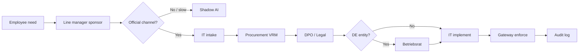

# Stakeholder journey map (R5 validated)

**Sources:** R3 corpus (55 items), practitioner batch 001, persona `dpo_fintech_de.md`, R2.

**Status:** Verified for planning — not statistically representative.

---

## Journey: "Employee wants new AI tool"

---

## Touchpoints × corpus evidence

| Stage | Actor | Pain (corpus) | TrustFlow surface |
|-------|-------|---------------|-------------------|
| Trigger | Employee | Productivity pressure (R0001) | Request UI |
| Shadow path | Employee | Bypass firewall, personal ChatGPT (R0005, R0006, R0014) | Gateway allowlist + approved alt |
| Policy | HR/Mgmt | "Copilot only" top-down (R0002, R0007) | Boardroom compiles policy |
| Network | IT | Umbrella/Fortinet AI category blocks (R0003, R0004) | Routing rules export |
| Enforcement | IT | "Policy without DLP is useless" (R0008) | Gateway PII + deny codes |
| Vendor | Procurement | VRM fail (R0011) | Procurement agent + tool registry |
| Privacy | DPO | Audit granularity, residency (R0013) | Audit schema + retention class |
| Labor | Betriebsrat | *Absent in EN corpus* — R2 practitioner | Works Council agent + gate |
| Cost | Finance | Seat + token burn (cost tags) | Budget pools in policy |

---

## Time compression narrative (demo)

| Status quo | With TrustFlow |
|------------|----------------|
| Weeks: email chains across IT/Legal/Procurement/BR | Minutes: agent boardroom session |
| Policy PDF nobody enforces | `rules.json` at gateway |
| Shadow AI grows while waiting | Deny with approved alternative route |

Numbers in strategy explorer (98% speedup) remain **illustrative** — label as projection in pitch.

---

## Agents ↔ journey mapping

| Journey stage | Primary agent |
|---------------|---------------|
| Employee advocacy | Runner |
| VRM / DPA | Procurement |
| GDPR / EU AI Act | Compliance |
| Betriebsvereinbarung | Works Council Liaison |
| Routing / cost | IT Infra |

---

## Gaps (English corpus blind spots)

| Topic | Evidence strength | Mitigation |
|-------|-------------------|------------|
| Betriebsrat by name | Weak in R3 | R2 + persona |
| EU AI Act article citations | Weak in R3 | R1 docs |
| German-language IT forums | Not scraped | Optional B12 r/gdpr |
| G2 buyer reviews | Not scraped | Fake-door interviews |

---

## Implication for hackathon story

Lead with **approval_process** pain (best evidenced), layer **DE-specific BR gate** as differentiation, show **gateway enforcement** answering R0008.
